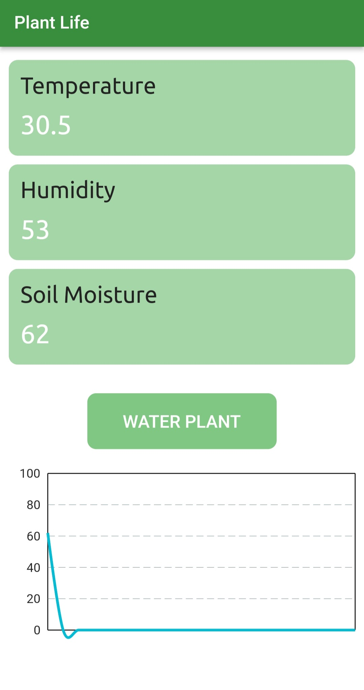
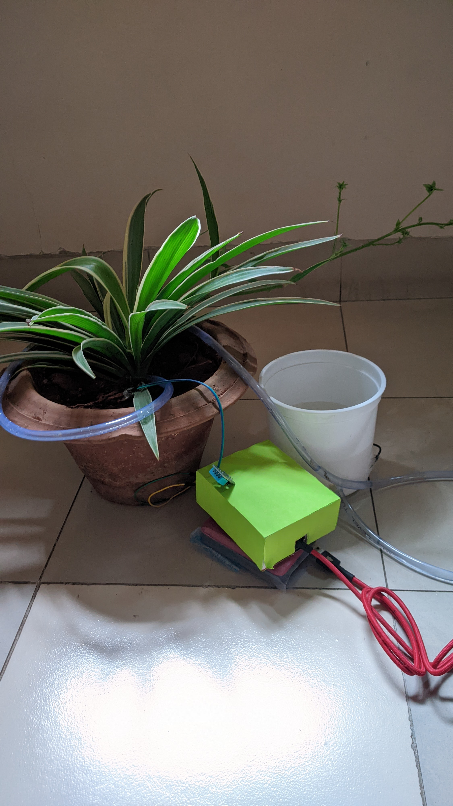

## Smart Plant Watering System

This is a plant watering system. It uses moisture sensor to detect the water percentage in the soil and water the plant automatically when it goes below 30%. It also uses temperature and humidity sensor to alert the user about the plants' health. All the readings are sent to an app where they are updated constantly to show the live readings.
The user can also manually press a button on the app to water the plant, regardless of the water percentage.

The mobile app is made using Flutter, with a very simple user interface.

[NodeMCU ESP8266](https://robu.in/product/nodemcu-cp2102-board/) is used as a microcontroller.

#### Components

1.  [FC-28](https://robu.in/product/soil-moisture-meter-soil-humidity-sensor-water-sensor-soil-hygrometer-ardunio/) - Soil Moisture Sensor
2.  [DHT11](https://robu.in/product/dht11-temperature-and-humidity-sensor-module-with-led/) - Temperature and Humidity Sensor
3.  [Water Pump](https://robu.in/product/dc-3-6-v-mini-micro-submersible-water-pump/)

#### Libraries Used

1.  ESP8266WiFi
2.  Firebase_ESP_Client
3.  SimpleTimer
4.  DHT

The app is used as the front end for activating the water pump and monitoring the output from the sensors .

### App screenshot

### Setup

## Setting Up The Development Environment

You can either use Arduino IDE or VSCode with the Arduino Extension.

1.  [Arduino Setup](https://www.instructables.com/How-to-Program-NodeMCU-on-Arduino-IDE/)
2.  Vscode 
    1.  Install the Arduino extension in VSCode.
    2.  Press ctrl+shift+p and type - “arduino initialize”, press enter and choose the following:
        1.  Enter the file name for your .ino file.
        2.  Board - NodeMCU 1.0 (ESP-12E Module).
        3.  Port - Depends on your machine.
        4.  Baud Rate - 115200
    3.  This will create an arduino.json file in .vscode folder.
    4.  Press ctrl+shift+p and type - “arduino library manager” and install all the above mentioned libraries.
